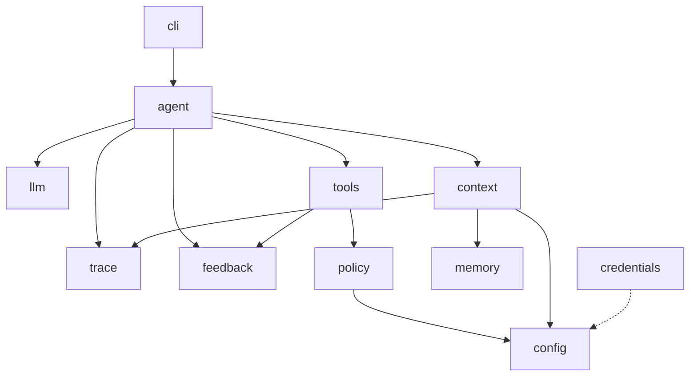
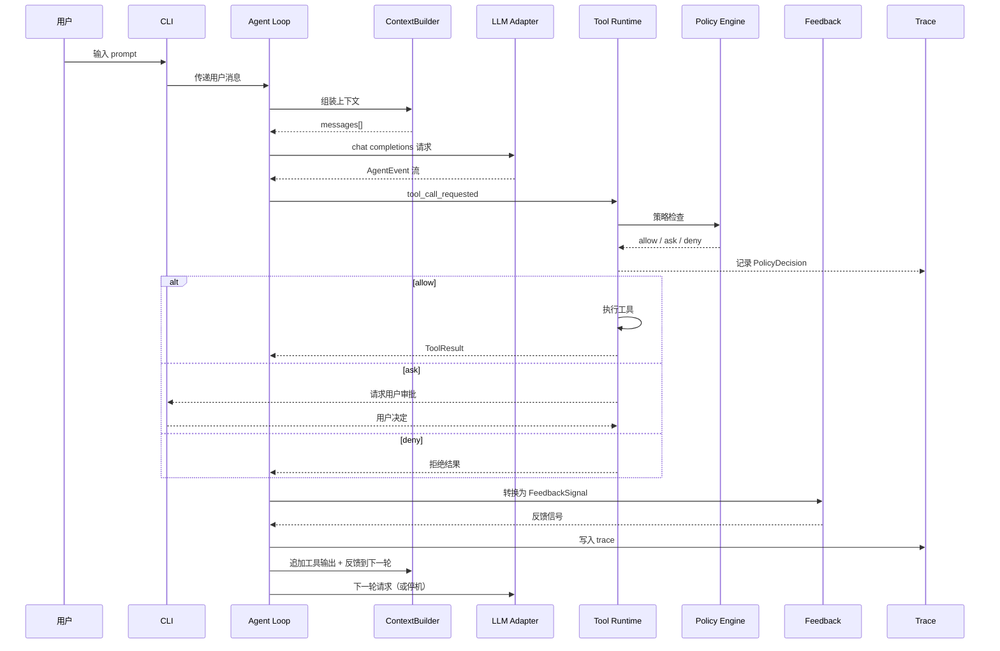

# PhyCode 规约文档

## 1. 问题陈述

PhyCode 是一个 CLI-first 的 Coding Agent Harness，包含自研 agent 主循环、OpenAI 兼容模型适配器、mock LLM 测试路径、策略感知工具运行时、反馈闭环、基础记忆/上下文管理、凭据处理、CI 和分发打包。长期愿景包括物理学领域扩展（如 Wolfram 工具、LaTeX 工作流、领域知识图谱），但课程交付物是一个完整、可扩展的通用 coding agent harness。物理领域工具作为未来扩展，不是核心的依赖项。

主要工程贡献是**策略感知工具运行时（Policy-Aware Tool Runtime）**：每个工具调用都经过 schema 验证、工作区边界检查、权限决策、执行包装、输出截断、反馈分类和 trace 记录。该机制整合了三个必需的机制族：工具分发、治理/安全和反馈。

## 2. 目标与非目标

### 目标

- 提供类似 Claude Code 的交互式 CLI agent 会话，同时保持实现轻量且可测试。
- 在代码中实现 harness 核心，而非依赖现成 agent runner。
- 支持 OpenAI 兼容的 chat completion 供应商，包括本地模型和国产开源模型服务。
- 通过 mock/stub LLM 和 fake 工具执行器保持所有核心测试的确定性。
- 通过确定性策略代码实施工作区和凭据安全。
- 为工具调用、策略决策、反馈信号和记忆变更提供可追溯的证据。
- 保留面向未来物理领域扩展的干净扩展路径。

### 非目标

- 无 WebUI。本项目以 CLI 为主；trace JSONL 提供结构化数据，未来可按需支持可视化层。
- 不包含 LSP 集成、MCP 集成、子 agent 编排、网页搜索、Wolfram、LaTeX 编译、文献检索或知识图谱。
- 不依赖 OpenAI Agents SDK、LangChain `AgentExecutor`、AutoGen、CrewAI、LlamaIndex agent 或宿主编码智能体 SDK 的 agent loop 作为产品核心。
- 不包含复杂向量记忆或语义长期检索。

## 3. 目标用户

- 构建和演示 AI4SE 期末项目的学生开发者。
- 希望在全新机器上运行 CLI coding harness 并安全配置凭据的未来用户。
- 希望用领域特定工具扩展 harness 的未来物理学生或研究者。

## 4. INVEST 用户故事

1. 作为开发者，我希望启动 `phycode` 后可以进行多轮交互会话，这样我不需要为每个 prompt 重新启动命令。

2. 作为开发者，我希望 agent 通过注册的工具来检查文件、编辑代码、执行命令和运行测试，这样它的行为是可观测和可控的。

3. 作为谨慎的用户，我希望危险的或超出工作区范围的操作被阻止或需要审批，这样 agent 不会损坏无关文件或泄露秘密。

4. 作为维护者，我希望每个工具结果都被转换为结构化反馈，这样 agent 可以对测试失败、命令错误、无效参数和策略阻止做出反应。

5. 作为项目评审者，我希望核心 agent 循环能在 mock LLM 下运行，这样我可以在没有网络和真实 API key 的情况下验证 harness。

6. 作为开发者，我希望查看已完成会话的结构化 trace，这样我可以理解调用了哪些工具、做了哪些策略决策、以及 agent 在哪里出了问题。

7. 作为安全意识强的用户，我希望 API key 安全存储且永不被打印到日志、记忆、trace 或配置文件中，这样仓库历史不会包含凭据。

## 5. 功能规约

### 5.1 CLI 与会话接口

输入：
- `phycode` 或 `phycode chat` 启动交互式会话。
- `phycode run "<task>"` 运行一个非交互式任务。
- `phycode tools list` 显示已注册工具及其风险等级。
- `phycode demo guardrail|feedback|policy` 运行确定性 mock 演示。
- `phycode config read|write` 管理非敏感配置。
- `phycode keys set|status|clear` 管理凭据。

行为：
- 交互式 CLI 在内存中维护会话历史，并将 trace 事件写入本地会话文件。
- CLI 使用轻量级终端格式渲染助手评论、最终回答、工具调用、策略决策和反馈。
- 推理摘要（如未来适配器提供）默认折叠。不要求也不暴露原始隐藏推理。
- 交互模式下，`ask` 类策略决策暂停并请求用户审批。
- 非交互模式下，`ask` 产生结构化 `policy_requires_approval` 结果，除非配置了明确的安全自动审批模式。

输出：
- 人类可读的终端输出。
- `.phycode/traces/` 下的结构化 trace JSONL。
- 非交互模式成功完成时退出码为 `0`，策略阻止、无效配置或不可恢复故障时为非零。

边界条件与错误处理：
- 未配置 LLM 供应商时，交互模式启动时报错并引导用户运行 `phycode keys set`。
- 无效的 CLI 参数由 typer 框架返回帮助信息。

### 5.2 Agent 主循环

agent 主循环由 PhyCode 自身代码实现，执行以下步骤：

1. 接收用户输入或待处理的审批响应。
2. 从系统指令、工具 schema、工作区摘要、记忆、最近事件和当前任务构建上下文。
3. 调用 LLM 适配器。
4. 将供应商响应规范化为内部 `AgentEvent` 流。
5. 将工具调用事件路由到策略感知工具运行时。
6. 将工具结果转换为反馈信号。
7. 将工具输出和反馈追加到下一轮模型输入。
8. 在最终回答、最大步数、用户中断、重复不可恢复故障或策略结果需要不可用的审批时停止。

主循环必须能用脚本化 mock LLM 进行测试。

边界条件与错误处理：
- LLM 适配器超时或返回格式异常时，统一转为 `error` 事件，由停机判断逻辑处理。
- 达到最大步数（默认 50）时自动停止并通知用户。

### 5.3 LLM 适配器

支持以下适配器：

- `ScriptedLLM`：确定性测试和演示用。
- `EchoLLM`：冒烟测试用。
- `FailingLLM`：供应商错误测试用。
- `OpenAICompatibleChatAdapter`：与 `/v1/chat/completions` 兼容供应商的真实交互。

主要的真实供应商路径使用 OpenAI 兼容的 `tools` / `tool_calls`。可为工具调用支持不稳定的供应商启用备用 JSON 动作解析器。产品核心不使用 OpenAI Agents SDK 作为循环运行器。

### 5.4 内部事件模型

供应商响应被规范化为以下事件类型：

- `assistant_commentary`：助手文本评论
- `reasoning_summary`：推理摘要
- `tool_call_requested`：工具调用请求
- `policy_decision`：策略决策
- `tool_call_running`：工具执行中
- `tool_call_output`：工具输出
- `feedback_signal`：反馈信号
- `assistant_final`：助手最终回答
- `error`：错误
- `incomplete`：不完整
- `user_interrupt`：用户中断

这避免了简单的文本/工具二分法，为 CLI 和 trace 存储提供了跨供应商的稳定表示。

### 5.5 工具注册与内置工具

每个工具声明：

- `name`：工具名称
- `description`：描述
- `input_schema`：输入 schema（JSON Schema 格式）
- `risk_level`：风险等级（`safe` | `risky` | `dangerous`）
- `executor`：执行器
- `feedback_mapper`：反馈映射器

内置工具：

- `file.read`：读取文件内容，支持 offset/limit 和截断元数据。
- `file.list`：列出工作区文件或目录。
- `file.write`：创建或覆写文件。
- `file.edit`：执行精确文本替换并返回 unified diff。
- `search.grep`：搜索文件内容，优先使用 `rg`。
- `search.glob`：按 glob 模式定位文件。
- `shell.run`：在工作区目录中运行有限时、有输出限制的命令。
- `test.run`：参数 `{command?, framework?}`；`command` 缺省时使用 `project_config.test_command`；`framework` 指定测试框架解析器（`pytest`、`jest`、`go`、`unknown`），用于将输出映射为结构化 `TestSummary`。
- `workspace.status`：报告工作区根目录、allowlist、git 状态和 diff 摘要。
- `memory.read`：读取项目记忆摘要。
- `memory.write`：写入显式长期记忆条目。
- `config.read`：读取非敏感配置。
- `config.write`：更新非敏感配置。
- `keys.status`：报告凭据存在性，不暴露秘密。

`keys.set` 和 `keys.clear` 是 CLI 命令，不是模型可调用的工具。

### 5.6 策略与护栏

策略引擎在任何工具执行前返回 `allow`、`ask` 或 `deny`。

默认策略：

- `allow`：安全的读取和状态操作。
- `ask`：文件写入/编辑、记忆写入、配置写入以及大多数 shell 命令。
- `deny`：路径逃逸、在允许根目录外写入、危险 shell 命令、凭据读取、破坏性系统操作和疑似凭据外泄。

策略要求：

- 所有路径在使用前解析，必须保持在工作区根目录或显式 allowlist 内。
- 符号链接逃逸视为边界违规。
- Shell 命令以配置的 `cwd`、超时和输出限制运行。
- 危险命令模式由确定性代码阻止。
- 凭据类文件（如 `.env`、私钥、token 存储）不可被模型可调用的文件工具读取。
- 每个决策在 trace 中记录规则 ID 和原因。

### 5.7 反馈闭环

工具结果被转换为 `FeedbackSignal` 记录，包含：

- `kind`：反馈类型
- `summary`：摘要
- `evidence`：证据
- `suggested_next_step`：建议的下一步
- `retryable`：是否可重试

反馈类型包括：

- `success`：成功
- `command_failed`：命令失败
- `test_failed`：测试失败
- `policy_blocked`：策略阻止
- `policy_requires_approval`：策略需要审批
- `invalid_tool_args`：无效工具参数
- `tool_error`：工具错误
- `timeout`：超时
- `output_truncated`：输出被截断
- `repeat_stuck`：同一工具+相似参数连续失败 ≥3 次，agent 陷入重复循环

上下文构建器将最近的高价值反馈包含在下一轮模型输入中。重复的类似失败触发停机或用户干预。

### 5.8 上下文、记忆与 Trace

存储组件：

- `SessionStore`：当前交互式会话的消息和事件。
- `TraceStore`：完整 JSONL trace，用于审查和调试。
- `MemoryStore`：经过整理的长期项目记忆。
- `ContextBuilder`：确定性上下文组装。

上下文构建顺序：

1. 稳定的系统指令。
2. 工具 schema。
3. 工作区摘要。
4. 项目记忆摘要。
5. 最近事件窗口。
6. 最近反馈。
7. 当前用户输入。

上下文预算行为：

- 长文件和命令输出在插入上下文前截断。
- 最近用户意图和最近反馈优先于旧评论。
- 静态 prompt 前缀保持稳定，以便在可用时利用供应商的 prompt 缓存。
- 正确性不依赖供应商缓存。

记忆写入：

- `memory.write` 受策略控制。
- 允许的类别为 `decision`、`preference`、`project_fact` 和 `test_command`。
- Trace 不被视为长期记忆。

设计备注：所有 trace 事件使用带有类型化事件种类、时间戳和脱敏状态的稳定 JSON schema。此结构化格式设计为无需修改 trace 写入器即可支持未来的可视化或回放工具。

### 5.9 凭据与配置

凭据命令：

- `phycode keys set openai-compatible`
- `phycode keys status`
- `phycode keys clear openai-compatible`

存储：

- 优先使用操作系统钥匙串（macOS Keychain / Windows Credential Manager / Linux Secret Service）。
- 如果钥匙串不可用，使用受主密码保护的本地加密文件。
- 环境变量和 `.env` 可作为可选来源，但需文档说明其明文风险。

敏感数据规则：

- API key 永不提交、记录日志、写入 trace、写入记忆或在终端输出中显示。
- 状态显示仅展示存在性/来源/更新时间。
- 错误处理对凭据类字符串进行脱敏。

边界条件与错误处理：
- 钥匙串不可用且用户拒绝创建加密文件时，回退到仅环境变量模式并输出明文风险警告。

配置：

- 用户配置存储默认供应商、base URL 和模型。
- 项目 `phycode.toml` 存储工作区 allowlist、测试命令、启用的工具和策略规则。
- 项目策略配置在安全边界上优先。

### 策略规则 Override TOML Schema

`phycode.toml` 中的 `[tool.phycode.policy.overrides]` 支持按 rule_id 前缀覆盖内置默认规则决策。以下为完整 schema 示例：

```toml
[tool.phycode.policy]
# 工作区根目录（绝对路径或相对路径）
workspace_root = "."

# 额外的允许路径（可多个）
allowlist = ["./libs", "./vendor", "/tmp/shared-cache"]

# 启用的工具名称列表（空 = 全部启用）
enabled_tools = []

# 测试命令（默认）
test_command = "uv run pytest"

# 策略规则覆盖：rule_id 前缀匹配，高优先级覆盖低优先级
# 支持工具名前缀匹配（如 "file.*"）和路径通配符
# 决策值：allow | ask | deny
[tool.phycode.policy.overrides]

# 示例：将所有文件写入操作改为 ask（覆盖 default.risky_action）
"file.write" = "ask"

# 示例：将 shell.run 默认改为 ask
"shell.run" = "ask"

# 示例：针对特定路径的规则
"file.read" = { decision = "allow", path_glob = "src/**/*" }
"file.read" = { decision = "deny", path_glob = "**/*.pem" }

# 示例：完全禁用危险工具
"shell.run.rm" = "deny"
```

**优先级顺序**：
1. 内置默认规则（`default.*`）
2. 项目 override 规则（`project.*`，来自 `phycode.toml`）
3. 运行时用户决策（仅 interactive 模式，`runtime.*`）

### 5.10 分发与 CI

开发路径：

- Python + `uv`
- `uv sync`
- `uv run phycode`
- `uv run pytest`

主要分发形态：

- 通过 `uv publish` 发布到 PyPI。
- 最终用户通过 `uvx phycode` 或 `pip install phycode` 安装。

可选：

- 如时间允许，Dockerfile 作为额外分发形态。

CI：

- `.github/workflows/ci.yml`（必需）：每次 push 自动运行测试；课程通用要求 §4.8 / §五明确为 GitHub Actions。
- `.gitlab-ci.yml`（必需）：用于 NJU Git 的 CI 校验；必须包含名为 `unit-test` 的 job。
- CI 仅使用 mock LLM，不需要 API key。

仓库平台：

- 当前开发使用 GitHub 仓库 `JianingZhangnan/AISE-copy`（对比实验版本）。
- 最终提交平台为 **NJU Git**（课程要求）；应以 GitHub 仓库为源镜像迁移，保留完整 commit / PR 历史与 CI 配置。

## 6. 非功能需求

### 6.1 性能

- 交互式 CLI 应及时显示工具和策略事件。
- 默认 shell 命令超时应防止挂起。
- 对于普通课程项目规模的仓库，上下文构建应快速完成。
- 长输出应在进入上下文前截断。

### 6.2 安全与凭据威胁模型

威胁：

- 模型请求读取 `.env` 或私钥文件。
- 模型发出删除或外泄数据的 shell 命令。
- 工具输出或异常包含 API key。
- Trace 或记忆存储敏感数据。
- 用户意外提交本地运行时状态。
- LLM API 调用被中间人攻击截获。
- API key 在进程内存中长期以明文存在。

缓解措施：

- 工作区边界强制执行。
- 凭据文件拒绝列表。
- 确定性 shell 命令护栏。
- 钥匙串/加密凭据存储。
- 记录日志、写入 trace 和显示前进行脱敏。
- `.gitignore` 排除 `.env`、运行时状态、日志和缓存。
- 凭据测试验证 status、trace 和 memory 不泄露秘密。
- 所有 LLM API 调用强制使用 HTTPS，默认启用证书验证。
- API key 仅在 LLM 调用期间保持在内存中，调用完成后从适配器状态中清除，不跨轮次缓存。

### 6.3 可用性

- 交互式 CLI 是主要接口。
- 非交互式 `run` 支持脚本和演示。
- 风险操作在审批前显示命令/diff/原因。
- 错误消息应清楚标识策略或工具故障。

### 6.4 可观测性

- 每个会话写入 trace JSONL。
- Trace 包含事件类型、工具名称、策略决策、反馈类型和脱敏后的摘要。
- 演示产生确定性 trace 以供审查。

### 6.5 可移植性

- 通过 `uv` 管理的 Python 包。
- 核心测试不需要网络或供应商凭据。
- Shell 策略应在可行范围内考虑 Windows 和 POSIX 的命令风险。
- 扩展性：工具通过注册接口添加，不修改主循环代码。

## 7. 系统架构

### 模块列表

- `cli`：Typer 命令、交互式循环 shell、Rich 渲染、审批提示。
- `agent`：主循环、停机控制器、事件处理。
- `llm`：OpenAI 兼容 chat 适配器和 mock LLM。
- `events`：内部 `AgentEvent` 和供应商规范化。
- `tools`：工具注册表和内置工具。
- `tools.specs`：`ToolSpec` 定义工厂与统一 `build_spec()` 帮助器。
- `policy`：工作区策略、凭据策略、shell 风险规则、审批模型。
- `feedback`：工具结果分类器。
- `context`：会话存储和上下文构建器。
- `memory`：项目记忆存储。
- `trace`：JSONL trace 存储和脱敏。
- `config`：用户和项目配置加载。
- `credentials`：钥匙串/加密文件秘密存储。

### 依赖方向

- `cli` 调用 `agent`。
- `agent` 调用 `llm`、`context`、`tools`、`trace` 和 `feedback`。
- `tools` 在执行器代码之前调用 `policy`。
- `policy` 使用 `config` 和工作区状态。
- `context` 读取 `memory`、`trace` 摘要、配置和会话历史。

### 模块依赖图



### 单轮 Agent 循环数据流



## 8. 数据模型

### 核心实体

- `AgentEvent`：`id`、`session_id`、`type`、`timestamp`、`payload`、`redaction_status`
- `ToolSpec`：`name`、`description`、`input_schema`、`risk_level`
- `ToolCall`：`id`、`tool_name`、`args`、`provider_call_id`
- `PolicyDecision`：`tool_call_id`、`decision`、`rule_id`、`reason`、`requires_user`
- `ToolResult`：`tool_call_id`、`status`、`stdout`、`stderr`、`artifact_refs`、`truncated`
- `FeedbackSignal`：`kind`、`summary`、`evidence`、`retryable`、`suggested_next_step`
- `MemoryEntry`：`id`、`category`、`content`、`source`、`created_at`
- `Session`：`id`、`workspace_root`、`created_at`、`mode`
- `ProviderConfig`：`provider`、`base_url`、`model`、`credential_ref`

### 实体关系

- `Session` (1) → (N) `AgentEvent`：一个会话包含多个事件。
- `ToolCall` (1) → (1) `PolicyDecision`：每个工具调用有且仅有一个策略决策。
- `ToolCall` (1) → (0..1) `ToolResult`：被拒绝的调用无结果。
- `ToolResult` (1) → (1..N) `FeedbackSignal`：一个结果产生至少一个反馈信号。
- `Session` (1) → (N) `MemoryEntry`：记忆条目关联到产生它的会话。

### 枚举约束

- `ToolSpec.risk_level`：`safe` | `risky` | `dangerous`
- `PolicyDecision.decision`：`allow` | `ask` | `deny`
- `MemoryEntry.category`：`decision` | `preference` | `project_fact` | `test_command`
- `FeedbackSignal.kind`：`success` | `command_failed` | `test_failed` | `policy_blocked` | `policy_requires_approval` | `invalid_tool_args` | `tool_error` | `timeout` | `output_truncated` | `repeat_stuck`
- `AgentEvent.type`：见 5.4 节事件类型列表
- `Session.mode`：`interactive` | `non_interactive`

### 存储

- `.phycode/traces/<session-id>.jsonl`
- `.phycode/memory.jsonl`
- `phycode.toml`
- 用户配置目录存放非敏感默认值
- 操作系统钥匙串或加密本地凭据文件存放秘密

`.phycode/` 为本地运行时状态，默认不应提交。

## 9. 技术选型与理由

### 编程语言：Python

开发者最熟悉的语言，拥有丰富的 CLI 工具、测试和 API 集成生态。项目约束要求使用 `uv` 包管理器，与 Python 生态天然匹配。

### CLI 框架：typer

基于 Click 构建的现代 CLI 框架，通过类型注解驱动参数解析，样板代码少于 argparse，自动生成帮助信息，与 Rich 集成良好。

### 终端渲染：rich

提供格式化、表格、语法高亮等终端渲染能力，在 Python CLI 工具中广泛使用，与 typer 自然集成。

### 数据验证：pydantic

通过 Python 类型注解进行 schema 验证，用于配置、事件模型和工具输入验证。可自动生成 JSON Schema 用于工具声明。

### 测试：pytest

Python 标准测试框架，支持 fixture、参数化和插件生态，与 mock/stub 集成简单直接。

### 凭据存储：keyring

跨平台凭据存储抽象（macOS Keychain、Windows Credential Manager、Linux Secret Service），避免重新实现平台特定 API。如不可用则回退到带主密码的加密文件。

### LLM 供应商：OpenAI 兼容 Chat Completions API

供应商兼容性最广（OpenAI、Azure、通过 Ollama/vLLM 的本地模型、DeepSeek/Qwen 等国产供应商），标准化 `tool_calls` 接口，避免供应商锁定。

### 包管理：uv

项目约束要求使用。快速的 Python 包管理，支持 lockfile，支持 `uvx` 零安装执行。

### 外部服务

- 可选的 OpenAI 兼容 LLM 供应商用于真实交互。
- 测试不需要外部服务。

## 10. 领域与机制设计

### 编码领域工具

- 文件检查和编辑。
- 搜索和 glob。
- Shell 执行。
- 测试/lint/类型检查执行。
- 工作区状态。
- 记忆/配置操作。

### 客观反馈信号

- 测试退出码和失败摘要。
- Shell 退出码、超时、stderr 和输出长度。
- 策略 allow/ask/deny。
- 编辑成功、无匹配、多匹配或路径违规。
- 工具参数验证失败。

### 危险动作

- 超出工作区的文件操作。
- 破坏性递归删除。
- 系统目录修改。
- 凭据文件读取。
- 网络外泄命令。
- 未经审批的发布、推送或全局安装。

### 记忆需求

- 项目约定。
- 用户决策。
- 首选测试命令。
- 已知工作区约束。

### 重点维度：策略感知工具运行时

本项目选择**策略感知工具运行时（Policy-Aware Tool Runtime）**作为深度实现维度，融合工具分发、治理护栏和反馈闭环三个机制族。

**选择理由：**

- 治理和反馈是课程推荐的深度维度中的两个，天然全部由确定性代码构成。
- 完全满足 §A.4(C) 的判定标准：移除真实 LLM 后，策略引擎、反馈分类器、工具分发等核心机制仍可通过单元测试独立验证。
- 演示效果最直观——「这个危险命令被拦截了」比「记忆检索更精准了」更容易被评审理解和验证。
- 工具分发、策略决策和反馈回灌发生在同一个运行时调用链中，深入实现它们的整合比分别浅尝更有工程深度。

**深度实现方案：**

策略引擎：
- 多层规则体系：内置默认规则 → 项目 `phycode.toml` 规则 → 运行时用户决策。高优先级规则覆盖低优先级。
- 规则匹配支持工具名前缀匹配（如 `file.*`）和路径通配符。
- 审批状态机：`pending → user_prompted → approved | rejected → executed | blocked`，每个状态转换记录到 trace。
- 危险命令检测使用可扩展的模式表（正则 + 关键词），覆盖 `rm -rf`、`DROP TABLE`、`curl | sh` 等模式。

内置默认 rule_id 清单：
- `default.path_in_workspace`：路径类工具必须落在 `workspace_root` 或 `allowlist`，否则 `deny`。
- `default.symlink_safe`：符号链接逃逸 → `deny`。
- `default.credential_files_blocked`：读取 `.env`、`*.pem`、`*.key`、`id_rsa` 等 → `deny`。
- `default.safe_allow`：风险等级为 `safe` 的工具 → `allow`。
- `default.risky_action`：文件写入/编辑/记忆写入/配置写入/大多数 shell 命令默认 → `ask`。

反馈分类器：
- 基于退出码、stderr 模式和输出结构的确定性分类，不依赖 LLM 判断。
- 测试结果解析器识别 pytest/jest/go test 等格式的通过/失败/跳过计数和失败用例名。
- 重复失败检测：连续 N 次相同工具+相似参数的失败触发停机建议。

工具运行时流水线：
- 统一入口：`validate_args → check_policy → execute → map_feedback → record_trace`。
- 每个阶段可独立 mock 测试。

## 11. 验收标准

项目验收条件：

- `phycode` 启动交互式会话。
- `phycode run "<task>"` 通过相同循环运行非交互式任务。
- `phycode tools list` 列出内置工具及其风险等级。
- `phycode demo guardrail` 展示危险命令被拒绝而未执行。
- `phycode demo feedback` 展示失败测试信号改变下一个 mock LLM 动作。
- `phycode demo policy` 展示工具运行时中的 ask/审批行为。
- `uv run pytest` 通过。
- `.gitlab-ci.yml` 包含 `unit-test` 运行测试套件。
- Mock LLM 测试覆盖核心循环。
- 策略测试覆盖安全读取、风险写入、危险 shell 拒绝、路径逃逸和凭据不泄露。
- 上下文测试覆盖截断和最近反馈包含。
- 凭据测试验证状态、trace 或记忆中不出现明文 key。
- README 说明安装、运行、测试、分发和安全 key 配置。
- SPEC、PLAN、SPEC_PROCESS 和 AGENT_LOG 已维护。

## 12. 风险与应对

- 物理领域工具的范围蔓延：推迟到未来扩展；核心 harness 必须独立成立。
- 不同供应商之间的 tool-call 兼容性差异：支持 OpenAI 兼容 tool calls 和备用 JSON 解析器。
- 过度使用供应商状态或 Agents SDK：保持 PhyCode 循环自实现。
- 安全仅靠提示词：在确定性代码和测试中强制护栏。
- 上下文管理过于复杂：仅实现会话历史、记忆摘要、截断和预算选择。
- 最终提交平台为 NJU Git（课程要求 §五）。当前在 GitHub 仓库 `JianingZhangnan/AISE-copy` 上开发；最终以本地仓库为源镜像迁移到 NJU Git。
- 真实 API 不稳定：CI 和必需演示保持在 mock LLM 上。

## 13. 未来扩展方向

未来可通过工具注册接口添加物理领域扩展（如 Wolfram 调用、LaTeX 编译与 lint、计算物理工作流引导、本地文献索引与检索、知识图谱工具），这些扩展不应修改核心 agent 循环。

## 14. 未决事项

- 最终提交平台为 NJU Git（课程已明确）。当前使用 GitHub 仓库 `JianingZhangnan/AISE-copy` 进行开发，提交 NJU Git 前需镜像迁移。
- Docker 打包为可选项，在核心 harness、测试、文档和 CI 完成后视时间决定。
- 如未来需要 WebUI 或演示可视化，trace JSONL 的结构化格式已预留支持。
